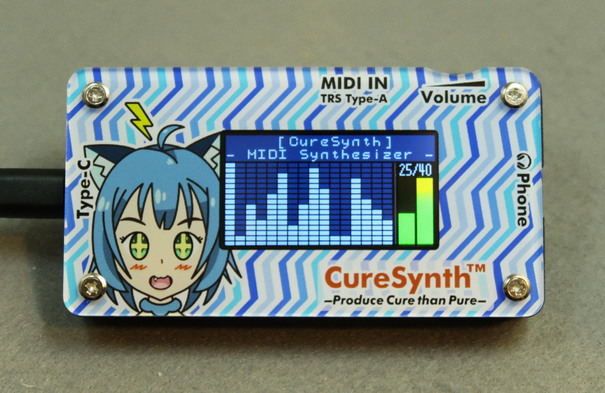

# MIDI Synthesizer "CureSynth mini"

## Overview

STM32H7を使用した、16パート40ボイスのオリジナルMIDI音源「CureSynth mini」です。詳細は、[curesynth.net](https://www.curesynth.net)を参照して下さい。

* [Demo movie on YouTube](https://www.youtube.com/watch?v=5bEdS2ZcP0E)

## Author

(c) 2022 Keshikan ( [Website](http://www.keshikan.net/),  [Twitter](https://twitter.com/keshinomi_88pro) )

## License

Source codes and schematic are licensed under [GPLv3](https://www.gnu.org/licenses/gpl-3.0.html) unless otherwise specified.
